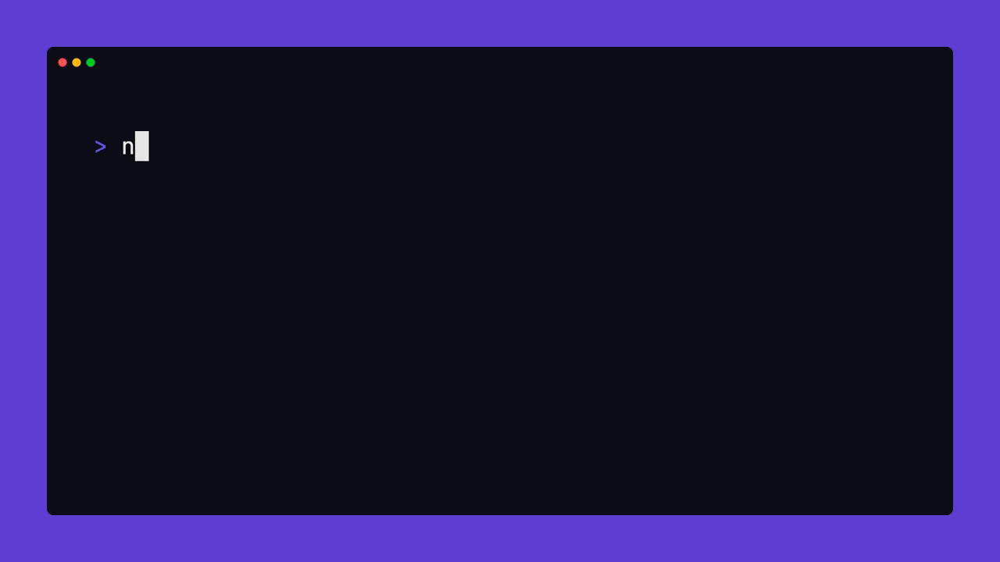

# Create GFX

</img>

Set up a Web graphics application blazingly fast!


## Prerequisites
Make sure you have either of the following installed:
- [Node.js](https://nodejs.org/en/learn/getting-started/how-to-install-nodejs)
- [Bun](https://bun.sh/)


## Usage
Depending on your available JavaScript package managers, you can use one of the following commands:
#### NPM
```bash
npm create gfx $PROJECT_NAME
# or
npx create-gfx $PROJECT_NAME
```
#### Yarn
```bash
yarn create gfx $PROJECT_NAME
# or
yarn dlx create-gfx $PROJECT_NAME
```
#### PNPM
```bash
pnpm create gfx $PROJECT_NAME
# or
pnpm dlx create-gfx $PROJECT_NAME
```
#### Bun
```bash
bun create gfx $PROJECT_NAME
# or
bunx create-gfx $PROJECT_NAME
```